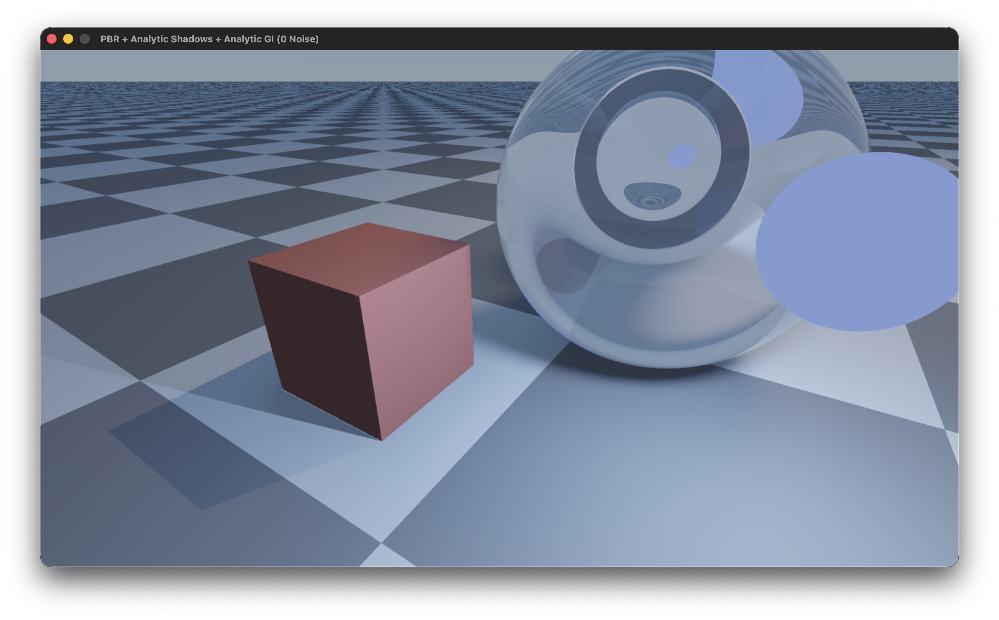
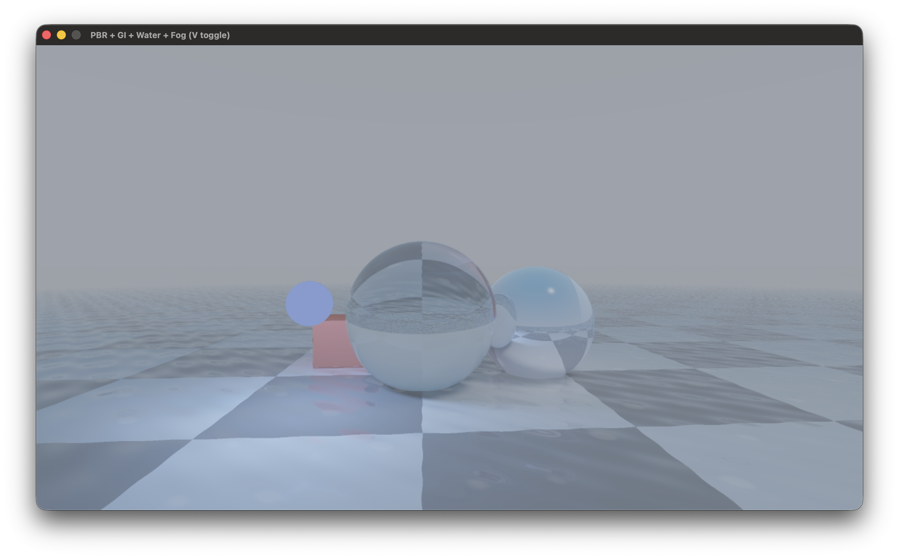
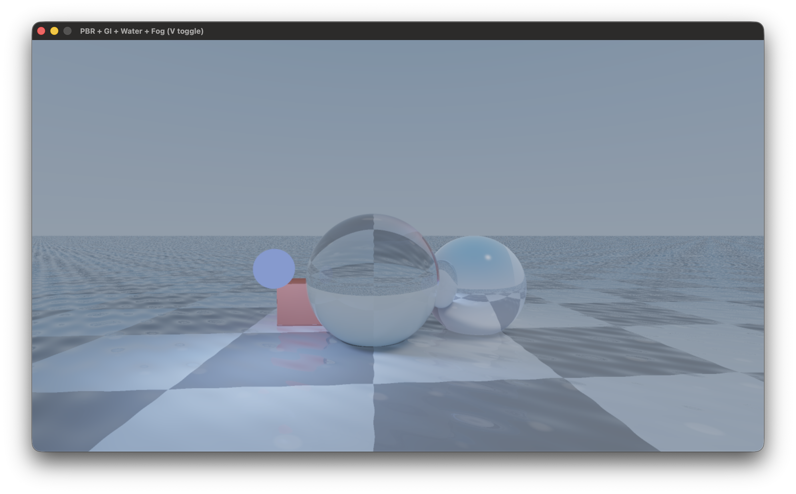

# Whitted GI Ray Tracing

A real-time ray tracer built around Turner Whitted's 1980 recursive illumination model. Renders analytical geometry and triangulated meshes entirely on the GPU using compute shaders — no rasterisation pipeline, no stochastic sampling noise.

Runs on Metal (macOS), OpenGL 4.3 (cross-platform), and Vulkan (stub, requires SDK).

---
<p align="center">
  <em>screenshot 1: Demo 0.2 (Shadows) &nbsp;&nbsp;
</p>
    
<p align="center">
  
  
  
</p>
<p align="center">
  <em>screenshot 2 & 3: Demo 0.3 (Procedural Water & Fog)&nbsp;&nbsp;
</p>

---

## How it works

Each frame, the GPU dispatches one compute thread per pixel. Every thread casts a primary ray from the camera through its pixel and resolves lighting by spawning secondary rays recursively via an explicit stack (no hardware ray tracing required):

- **Shadow rays** — one per light source per bounce, determining direct occlusion via analytic cone-sphere overlap rather than stochastic sampling.
- **Reflection rays** — spawned for metallic and glossy surfaces.
- **Refraction rays** — computed with Snell's law and Schlick's Fresnel approximation for glass and water materials.

Indirect lighting is approximated analytically: ambient occlusion comes from form-factor integration over nearby sphere volumes, and inter-object colour bleeding uses distance-weighted albedo transfer between primitives. The sky model blends towards a horizon colour and contributes ambient light through dot-product weighting. Tone mapping is Reinhard with gamma 2.2 correction.

For triangle meshes, a BVH is built on the CPU using midpoint splits and uploaded as a flat buffer. The shader traverses it iteratively with a thread-local stack and tests leaves using the Möller–Trumbore intersection formula. Per-vertex normals are interpolated barycentrically for smooth shading.

---

## Features

- Recursive Whitted ray tracing up to depth 7
- Analytical soft shadows (cone-sphere occlusion)
- Analytical ambient occlusion
- Analytical global illumination (form-factor inter-object bounce)
- Procedural animated water with Fresnel reflection and refraction
- Height-based volumetric fog
- Adjustable sub-pixel supersampling (1 to 4 samples per pixel)
- Sub-pixel temporal jitter
- GLB / glTF 2.0 mesh loading with full PBR material extraction
- OBJ mesh loading
- Automatic mesh scaling and centering
- BVH acceleration structure (CPU build, GPU traversal)
- Möller–Trumbore triangle intersection with interpolated normals
- Analytic rigid-body physics (gravity, elastic floor, sphere collisions)
- Real-time ImGui panel: resolution, rendering modes, mesh loader, physics toggle
- In-app file browser for mesh selection
- Persistent config file
- Fullscreen toggle

---

## Dependencies

SDL2, Assimp, and Bullet must be installed on the system. Everything else is fetched automatically at configure time.

```
brew install sdl2 assimp bullet
```

| Library | Source | Purpose |
|---|---|---|
| SDL2 | Homebrew | Window, input, Metal/OpenGL context |
| Assimp 6.x | Homebrew | GLB, glTF 2.0, OBJ loading |
| Bullet 3.25 | Homebrew | Physics (linked; simulation is custom) |
| Dear ImGui | Fetched from GitHub | HUD and controls |
| ImGuiFileDialog | Fetched from GitHub | In-app file browser |
| stb_image | Downloaded (single header) | Image utilities |
| svenstaro/bvh | Fetched from GitHub | Header-only BVH reference |

**Credits:**
Turner Whitted — original algorithm (1980).
Omar Cornut — [Dear ImGui](https://github.com/ocornut/imgui).
Sean Barrett — [stb](https://github.com/nothings/stb).
Sven-Hendrik Haase — [bvh](https://github.com/svenstaro/bvh).
aiekick — [ImGuiFileDialog](https://github.com/aiekick/ImGuiFileDialog).
The Assimp team — [Open Asset Import Library](https://github.com/assimp/assimp).

---

## Building

### Metal (macOS)

```bash
cmake -B build_metal -DUSE_METAL=ON -DUSE_VULKAN=OFF -DUSE_OPENGL=OFF
cmake --build build_metal -j$(nproc)
./build_metal/Whitted_GI_RayTracer
```

### OpenGL

```bash
cmake -B build_gl -DUSE_METAL=OFF -DUSE_VULKAN=OFF -DUSE_OPENGL=ON
cmake --build build_gl -j$(nproc)
./build_gl/Whitted_GI_RayTracer
```

### Vulkan (requires Vulkan SDK)

```bash
cmake -B build_vk -DUSE_METAL=OFF -DUSE_VULKAN=ON -DUSE_OPENGL=OFF
cmake --build build_vk -j$(nproc)
```

---

## Configuration

`config.txt` is created next to the binary on first launch. All values can also be changed at runtime through the ImGui panel.

```ini
width=1280
height=720
fullscreen=0
enable_physics=1
enable_jitter=0
enable_checkerboard=0
model_path=
model_x=0
model_y=0
model_z=-3
```

| Key | Description |
|---|---|
| `width` / `height` | Startup resolution |
| `fullscreen` | 1 = launch in fullscreen |
| `enable_physics` | 1 = objects fall and collide |
| `enable_jitter` | 1 = sub-pixel jitter per frame |
| `samples` | Number of ray samples per pixel (1 to 4) |
| `model_path` | Path to GLB / glTF / OBJ file (empty = primitive scene) |
| `model_x/y/z` | World position of the loaded model |

---

## Controls

| Input | Action |
|---|---|
| W A S D | Move |
| Q / E | Move down / up |
| Mouse | Look |
| M | Toggle mouse capture |
| V | Toggle fog |
| F11 | Toggle fullscreen |
| Esc | Quit |

---

## Loading a model

Click the `...` button in the panel to open the file browser. Select a `.glb`, `.gltf`, or `.obj` file, set the X / Y / Z position, then click **Load Model**.

The mesh is automatically centred and scaled to fit within 2 world units. Primitives (spheres, cubes) are hidden while a mesh is active. The floor plane remains in both modes. Click **Remove Model** to restore the primitive scene.

---

## Rendering modes

**Jitter** offsets subpixel sample positions each frame using a hash seeded by time. Softens aliasing without increasing sample count. Adds slight temporal shimmer during camera movement.

**Samples (AA)** increases the number of rays cast per pixel per frame (up to 4). Defaults to 1 for maximum performance. Higher values produce perfectly smooth edges (SSAA) at the cost of GPU time.

---

## Test hardware

| | |
|---|---|
| Machine | MacBook Pro 16,1 (2019) |
| CPU | Intel Core i9, 8 cores |
| GPU | AMD Radeon Pro 5500M, 8 GB GDDR6 |
| RAM | 32 GB DDR4 |
| OS | macOS 26.5.1 |
| API | Metal (compute) |

At 1280x720 with Demo 0.3, depth 7: approximately 60 fps. Checkerboard mode brings this to around 110 fps with acceptable quality.

---

## Project layout

```
RayTracer_Unified/
├── CMakeLists.txt
├── README.md
├── config.txt
├── includes/
│   ├── Scene.h             GPU structs, Vec3, material types
│   ├── Renderer.h          IRenderer interface
│   ├── ModelLoader.h       Assimp loader and MeshData
│   └── Physics.h           PhysicsWorld
├── src/
│   ├── main.cpp
│   ├── ModelLoader.cpp     Assimp import, auto-scale, BVH build
│   ├── Physics.cpp         Rigid body simulation
│   └── backends/
│       ├── Metal/
│       │   ├── RendererMetal.mm
│       │   ├── shader_v02.metal
│       │   └── shader_v03.metal
│       ├── OpenGL/
│       │   ├── RendererGL.cpp
│       │   ├── shader_v02.comp
│       │   └── shader_v03.comp
│       └── Vulkan/
│           ├── RendererVK.cpp
│           └── shader_v03.comp
└── screenshot/
